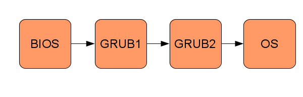

# First Steps

Developing an operating system (OS) is no easy task, and the question "How do I
even begin to solve this problem?" is likely to come up several times during
the course of the project for different problems. This chapter will help you
set up your development environment and booting a very small (and primitive)
operating system.

## Tools

### Quick Setup
We (the authors) have used Ubuntu [@ubuntu] as the operating system for doing
OS development, running it both physically and virtually (using the
virtual machine VirtualBox [@virtualbox]). A quick way to get everything up and
running is to use the same setup as we did, since we know that these tools
work with the samples provided in this book.

Once Ubuntu is installed, either physical or virtual, the following packages
should be installed using `apt-get`:

~~~ {.bash}
    sudo apt-get install build-essential nasm genisoimage bochs bochs-sdl
~~~

### Programming Languages
The operating system will be developed using the C programming language
[@knr][@wiki:c], using GCC [@gcc]. We use C because developing an OS requires a very precise
control of the generated code and direct access to memory. Other languages that
provide the same features can also be used, but this book will only cover C.

The code will make use of one type attribute that is specific for GCC:

~~~
    __attribute__((packed))
~~~

This attribute allows us to ensure that the compiler uses a memory layout for a
`struct` exactly as we define it in the code. This is explained in more detail
in the next chapter.

Due to this attribute, the example code might be hard to compile using a C
compiler other than GCC.

For writing assembly code, we have chosen NASM [@nasm] as the assembler, since we
prefer NASM's syntax over GNU Assembler.

Bash [@wiki:bash] will be used as the scripting language throughout the book.

### Host Operating System
All the code examples assumes that the code is being compiled on a UNIX like
operating system. All code examples have been successfully compiled using
Ubuntu [@ubuntu] versions 11.04 and 11.10.

### Build System
Make [@make] has been used when constructing the Makefile examples.

### Virtual Machine
When developing an OS it is very convenient to be able to run your code in a
_virtual machine_ instead of on a physical computer, since starting your OS in
a virtual machine is much faster than getting your OS onto a physical medium
and then running it on a physical machine.
Bochs [@bochs] is an
emulator for the x86 (IA-32) platform which is well suited for OS development
due to its debugging features. Other popular choices are QEMU [@qemu] and
VirtualBox [@virtualbox]. This book uses Bochs.

By using a virtual machine we cannot ensure that our OS works on real, physical
hardware. The environment simulated by the virtual machine is designed to be
very similar to their physical counterparts, and the OS can be tested on one by
just copying the executable to a CD and finding a suitable machine.

## Booting
Booting an operating system consists of transferring control along a
chain of small programs, each one more "powerful" than the previous one, where
the operating system is the last "program". See the following figure for an
example of the boot process:

### BIOS
When the PC is turned on, the computer will start a small program that adheres
to the _Basic Input Output System_ (BIOS) [@wiki:bios] standard. This program is
usually stored on a read only memory chip on the motherboard of the PC. The
original role of the BIOS program was to export some library functions for
printing to the screen, reading keyboard input etc. Modern operating
systems do not use the BIOS' functions, they use drivers that interact
directly with the hardware, bypassing the BIOS.
Today, BIOS mainly runs some early diagnostics (power-on-self-test) and then
transfers control to the bootloader.

### The Bootloader
The BIOS program will transfer control of the PC to a program called a
_bootloader_. The bootloader's task is to transfer control to us, the operating
system developers, and our code. However, due to some restrictions[^1] of the
hardware and because of backward compatibility, the bootloader is often split
into two parts: the first part of the bootloader will transfer control to the
second part, which finally gives control of the PC to the operating system.

[^1]: The bootloader must fit into the _master boot record_ (MBR) boot sector
of a hard drive, which is only 512 bytes large.

Writing a bootloader involves writing a lot of low-level code that interacts
with the BIOS. Therefore, an existing bootloader will be used: the GNU GRand
Unified Bootloader (GRUB) [@grub].

Using GRUB, the operating system can be built as an ordinary ELF [@wiki:elf]
executable, which will be loaded by GRUB into the correct memory location.
The compilation of the kernel requires that the code is laid out in
memory in a specific way (how to compile the kernel will be discussed later in
this chapter).

### The Operating System
GRUB will transfer control to the operating system by jumping to a position in
memory. Before the jump, GRUB will look for a magic number to ensure that it is
actually jumping to an OS and not some random code. This magic number is part
of the _multiboot specification_ [@multiboot] which GRUB adheres to. Once GRUB
has made the jump, the OS has full control of the computer.

## Hello Cafebabe
This section will describe how to implement of the smallest possible OS that
can be used together with GRUB. The only thing the OS will do is write
`0xCAFEBABE` to the `eax` register (most people would probably not even call
this an OS).

### Compiling the Operating System
This part of the OS has to be written in assembly code, since C requires a
stack, which isn't available (the chapter ["Getting to C"](#getting-to-c)
describes how to set one up). Save the following code in a file called
`loader.s`:

~~~ {.nasm}
    global loader                   ; the entry symbol for ELF

    MAGIC_NUMBER equ 0x1BADB002     ; define the magic number constant
    FLAGS        equ 0x0            ; multiboot flags
    CHECKSUM     equ -MAGIC_NUMBER  ; calculate the checksum
                                    ; (magic number + checksum + flags should equal 0)

    section .text:                  ; start of the text (code) section
    align 4                         ; the code must be 4 byte aligned
        dd MAGIC_NUMBER             ; write the magic number to the machine code,
        dd FLAGS                    ; the flags,
        dd CHECKSUM                 ; and the checksum

    loader:                         ; the loader label (defined as entry point in linker script)
        mov eax, 0xCAFEBABE         ; place the number 0xCAFEBABE in the register eax
    .loop:
        jmp .loop                   ; loop forever
~~~

The only thing this OS will do is write the very specific number
`0xCAFEBABE` to the `eax` register. It is _very_ unlikely that the number
`0xCAFEBABE` would be in the `eax` register if the OS did _not_ put it
there.

The file `loader.s` can be compiled into a 32 bits ELF [@wiki:elf] object file
with the following command:

~~~ {.bash}
    nasm -f elf32 loader.s
~~~

### Linking the Kernel
The code must now be linked to produce an executable file, which requires some
extra thought compared to when linking most programs. We want GRUB to load the
kernel at a memory address larger than or equal to `0x00100000` (1 megabyte
(MB)), because addresses lower than 1 MB are used by GRUB itself, BIOS
and memory-mapped I/O. Therefore, the following linker script is needed
(written for GNU LD [@gnubinutils]):

~~~
ENTRY(loader)                /* the name of the entry label */

SECTIONS {
    . = 0x00100000;          /* the code should be loaded at 1 MB */

    .text ALIGN (0x1000) :   /* align at 4 KB */
    {
        *(.text)             /* all text sections from all files */
    }

    .rodata ALIGN (0x1000) : /* align at 4 KB */
    {
        *(.rodata*)          /* all read-only data sections from all files */
    }

    .data ALIGN (0x1000) :   /* align at 4 KB */
    {
        *(.data)             /* all data sections from all files */
    }

    .bss ALIGN (0x1000) :    /* align at 4 KB */
    {
        *(COMMON)            /* all COMMON sections from all files */
        *(.bss)              /* all bss sections from all files */
    }
}
~~~

Save the linker script into a file called `link.ld`. The executable can now be
linked with the following command:

~~~ {.bash}
    ld -T link.ld -melf_i386 loader.o -o kernel.elf
~~~

The final executable will be called `kernel.elf`.

### Obtaining GRUB
The GRUB version we will use is GRUB Legacy, since the OS ISO image can then be
generated on systems using both GRUB Legacy and GRUB 2. More specifically, the
GRUB Legacy `stage2_eltorito` bootloader will be used. This file can be built
from GRUB 0.97 by downloading the source from
<ftp://alpha.gnu.org/gnu/grub/grub-0.97.tar.gz>.  However, the `configure`
script doesn't work well with Ubuntu [@ubuntu-grub], so the binary file can be
downloaded from <http://littleosbook.github.com/files/stage2_eltorito>. Copy
the file `stage2_eltorito` to the folder that already contains `loader.s` and
`link.ld`.

### Building an ISO Image
The executable must be placed on a media that can be loaded by a virtual or
physical machine. In this book we will use ISO [@wiki:iso] image files as the
media, but one can also use floppy images, depending on what the virtual or
physical machine supports.

We will create the kernel ISO image with the program `genisoimage`. A folder
must first be created that contains the files that will be on the ISO image.
The following commands create the folder and copy the files to their correct
places:

~~~ {.bash}
    mkdir -p iso/boot/grub              # create the folder structure
    cp stage2_eltorito iso/boot/grub/   # copy the bootloader
    cp kernel.elf iso/boot/             # copy the kernel
~~~

A configuration file `menu.lst` for GRUB must be created. This file tells GRUB
where the kernel is located and configures some options:

~~~
    default=0
    timeout=0

    title os
    kernel /boot/kernel.elf
~~~

Place the file `menu.lst` in the folder `iso/boot/grub/`. The contents of the
`iso` folder should now look like the following figure:

~~~
    iso
    |-- boot
      |-- grub
      | |-- menu.lst
      | |-- stage2_eltorito
      |-- kernel.elf
~~~

The ISO image can then be generated with the following command:

~~~
    genisoimage -R                              \
                -b boot/grub/stage2_eltorito    \
                -no-emul-boot                   \
                -boot-load-size 4               \
                -A os                           \
                -input-charset utf8             \
                -quiet                          \
                -boot-info-table                \
                -o os.iso                       \
                iso
~~~

For more information about the flags used in the command, see the manual for
`genisoimage`.

The ISO image `os.iso` now contains the kernel executable, the GRUB
bootloader and the configuration file.

### Running Bochs
Now we can run the OS in the Bochs emulator using the `os.iso` ISO image.
Bochs needs a configuration file to start and an example of a simple
configuration file is given below:

~~~
    megs:            32
    display_library: sdl
    romimage:        file=/usr/share/bochs/BIOS-bochs-latest
    vgaromimage:     file=/usr/share/bochs/VGABIOS-lgpl-latest
    ata0-master:     type=cdrom, path=os.iso, status=inserted
    boot:            cdrom
    log:             bochslog.txt
    clock:           sync=realtime, time0=local
    cpu:             count=1, ips=1000000
~~~

You might need to change the path to `romimage` and `vgaromimage` depending on
how you installed Bochs. More information about the Bochs config file can be
found at Boch's website [@bochs-config].

If you saved the configuration in a file named `bochsrc.txt` then you can run
Bochs with the following command:

~~~
    bochs -f bochsrc.txt -q
~~~

The flag `-f` tells Bochs to use the given configuration file and the flag `-q`
tells Bochs to skip the interactive start menu. You should now see Bochs
starting and displaying a console with some information from GRUB on it.

After quitting Bochs, display the log produced by Boch:

~~~
    cat bochslog.txt
~~~

You should now see the contents of the registers of the CPU simulated by Bochs
somewhere in the output. If you find `RAX=00000000CAFEBABE` or `EAX=CAFEBABE`
(depending on if you are running Bochs with or without 64 bit support) in the
output then your OS has successfully booted!

## Further Reading
- Gustavo Duertes has written an in-depth article about what actually happens
  when a x86 computer boots up,
  <http://duartes.org/gustavo/blog/post/how-computers-boot-up>
- Gustavo continues to describe what the kernel does in the very early
  stages at <http://duartes.org/gustavo/blog/post/kernel-boot-process>
- The OSDev wiki also contains a nice article about booting an x86 computer:
  <http://wiki.osdev.org/Boot_Sequence>
